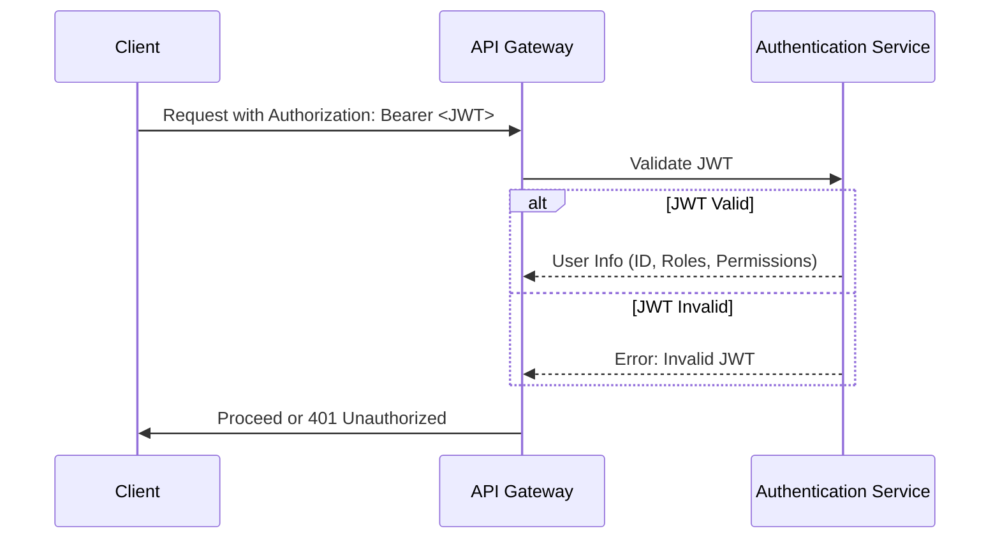
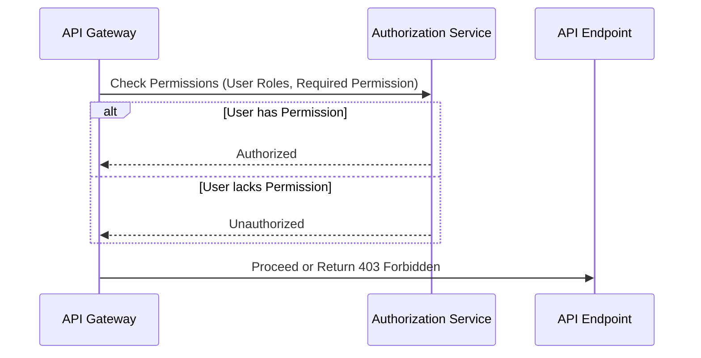

# Authentication and Authorization Service Specifications

## 1. Introduction

This document outlines the specifications and requirements for the Authentication and Authorization Services. These services are crucial for securing the API endpoints of the Slack English Learning Bot, ensuring that only authenticated users with the appropriate permissions can access protected resources.

## 2. Goals

*   Securely authenticate users accessing the system.
*   Authorize access to resources based on user roles and permissions.
*   Provide a flexible and scalable authentication and authorization solution.
*   Integrate seamlessly with the API Gateway.
*   Use industry-standard security practices.

## 3. Authentication Service

### 3.1. Overview

The Authentication Service is responsible for verifying the identity of users attempting to access the system. It validates user credentials (e.g., JWT) and confirms that the user is who they claim to be.

### 3.2. Authentication Methods

*   **JWT (JSON Web Token) Authentication:**
    *   The primary authentication method.
    *   Clients must provide a valid JWT in the `Authorization` header of their requests.
    *   The JWT should be issued by the Authentication Service upon successful login.

### 3.3. Authentication Process

1.  **Client Request:** Client sends a request to the API Gateway with the JWT in the `Authorization` header.
2.  **API Gateway Validation:** The API Gateway forwards the JWT to the Authentication Service for validation.
3.  **Authentication Service Validation:** The Authentication Service performs the following checks:
    *   **Signature Verification:** Verifies the JWT signature to ensure it hasn't been tampered with.
    *   **Expiration Check:** Checks if the JWT has expired.
    *   **Issuer Validation:** (Optional) Checks if the JWT was issued by a trusted issuer.
    *   **Audience Validation:** (Optional) Checks if the JWT is intended for the correct audience.
4.  **Authentication Result:**
    *   If the JWT is valid, the Authentication Service returns user information (e.g., user ID, roles, permissions) to the API Gateway.
    *   If the JWT is invalid, the Authentication Service returns an error to the API Gateway.

### 3.4. Authentication Flow (Mermaid Diagram)



### 3.5. JWT Specification

*   **Claims:** The JWT should contain the following claims:
    *   `sub` (Subject): The user ID.
    *   `iat` (Issued At): The timestamp when the JWT was issued.
    *   `exp` (Expiration Time): The timestamp when the JWT expires.
    *   `roles` (Custom Claim): An array of roles assigned to the user (e.g., `["admin", "teacher"]`).
    *   `permissions` (Custom Claim): An array of permissions granted to the user (e.g., `["MANAGE_QUESTIONS", "ANSWER_QUESTION"]`). (Alternatively, these can be derived from roles).
*   **Signature Algorithm:**  Use a strong signature algorithm like `RS256` or `HS256`.
*   **Expiration Time:**  Set an appropriate expiration time for the JWT (e.g., 1 hour, 1 day).
*   **Key Rotation:** Implement a mechanism for rotating the signing keys periodically to enhance security.

### 3.6. Error Responses

*   **401 Unauthorized:**
    *   Returned when the JWT is missing, invalid, or expired.

```json
{
  "error": "Unauthorized: Invalid or missing JWT."
}
```

### 3.7. Implementation Notes

*   Use a well-established JWT library (e.g., `jsonwebtoken` for Node.js) for generating and verifying JWTs.
*   Store the signing keys securely (e.g., using environment variables, vault).
*   Implement proper error handling and logging.
*   Consider using refresh tokens to allow users to obtain new JWTs without re-entering their credentials.

## 4. Authorization Service

### 4.1. Overview

The Authorization Service determines whether an authenticated user has the necessary permissions to access a specific resource or perform a specific action.

### 4.2. Authorization Methods

*   **Role-Based Access Control (RBAC):**
    *   Users are assigned to roles, and roles are granted permissions.
    *   The Authorization Service checks if the user's roles have the required permission.

### 4.3. Authorization Process

1.  **API Gateway Request:** The API Gateway receives a request from an authenticated user.
2.  **Permission Check:** The API Gateway sends the user's roles and the required permission to the Authorization Service.
3.  **Authorization Service Evaluation:** The Authorization Service checks if any of the user's roles have the required permission.  This might involve looking up role-permission mappings in a database or configuration file.
4.  **Authorization Result:**
    *   If the user has the required permission, the Authorization Service returns "Authorized" to the API Gateway.
    *   If the user does not have the required permission, the Authorization Service returns "Unauthorized" to the API Gateway.

### 4.4. Authorization Flow (Mermaid Diagram)



### 4.5. Permission Mapping

*   Permissions are mapped to roles using a database or configuration file.
*   The mapping should be easily configurable to allow for adding, removing, or modifying permissions and roles.

### 4.6. Error Responses

*   **403 Forbidden:**
    *   Returned when the user does not have the required permission to access the resource.

```json
{
  "error": "Forbidden: Insufficient permissions."
}
```

### 4.7. Implementation Notes

*   Store role-permission mappings in a database or configuration file.
*   Implement efficient algorithms for checking permissions.
*   Consider using a caching mechanism to improve performance.
*   Provide a mechanism for administrators to manage roles and permissions.
*   Integrate with the Authentication Service to obtain user roles and permissions.

## 5. Integration with API Gateway

*   The API Gateway acts as the entry point for all API requests.
*   It intercepts requests and forwards them to the Authentication and Authorization Services for validation.
*   Based on the results from these services, the API Gateway either forwards the request to the appropriate API endpoint or returns an error to the client.

## 6. Technologies

*   **Programming Language:** (Specify the language, e.g., Node.js, Go, Python)
*   **JWT Library:** (Specify the library, e.g., `jsonwebtoken`, `go-jwt`)
*   **Database:** (Specify the database, e.g., PostgreSQL, MongoDB)
*   **Framework:** (Specify the framework, e.g., ElysiaJS, Express, Flask)

## 7. Security Considerations

*   **Protect Signing Keys:** Store signing keys securely and implement key rotation.
*   **Validate Inputs:**  Thoroughly validate all inputs to prevent injection attacks.
*   **Use HTTPS:**  Ensure that all communication is encrypted using HTTPS.
*   **Regular Security Audits:**  Conduct regular security audits to identify and address potential vulnerabilities.
*   **Rate Limiting:**  Implement rate limiting to prevent brute-force attacks.

## 8. Scalability

*   Design the Authentication and Authorization Services to be horizontally scalable.
*   Consider using a load balancer to distribute traffic across multiple instances of the services.
*   Use a caching mechanism to reduce the load on the database.

## 9. Future Enhancements

*   **Multi-Factor Authentication (MFA):**  Add support for MFA to enhance security.
*   **Delegation:**  Implement delegation mechanisms (e.g., OAuth 2.0) to allow third-party applications to access resources on behalf of users.
*   **Attribute-Based Access Control (ABAC):**  Explore ABAC as a more flexible authorization model.
