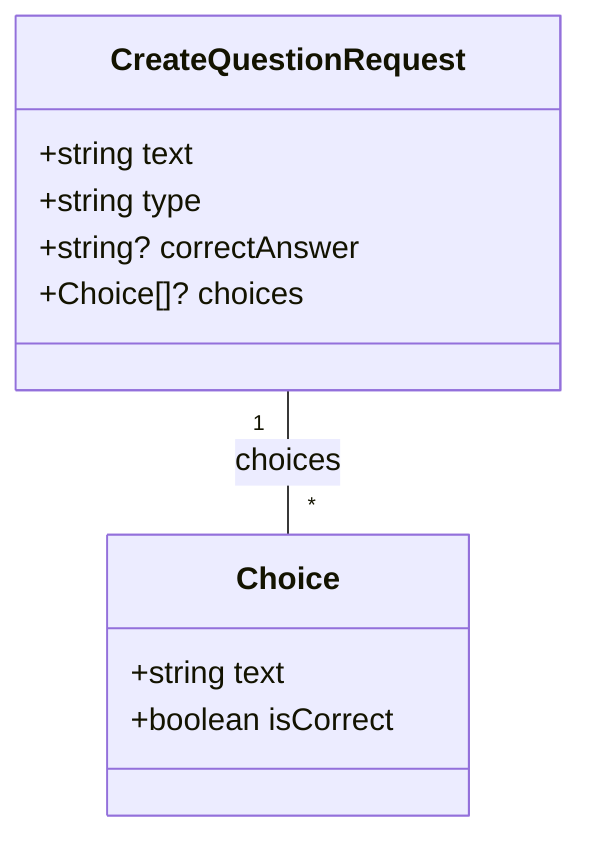
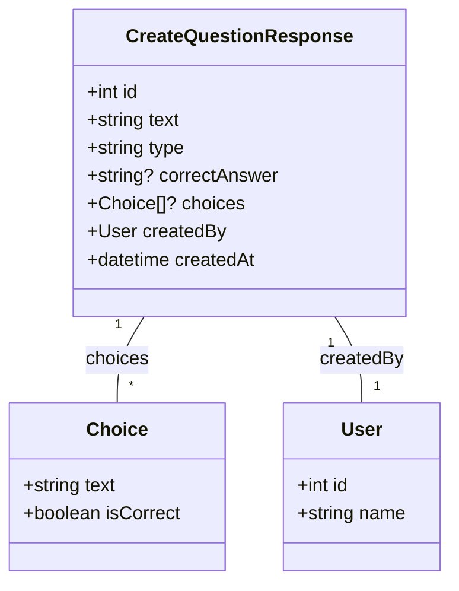
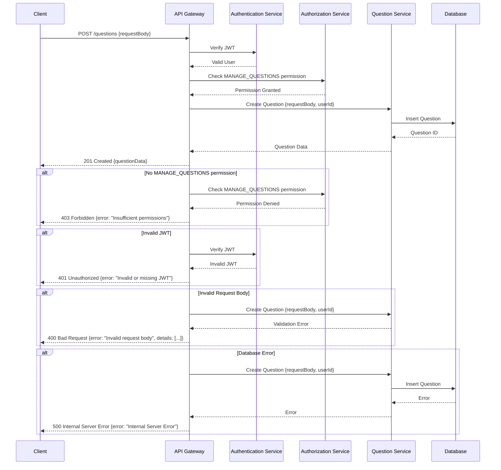

# Create Question API Specification

## 1. Introduction

This document outlines the detailed requirements and specifications for the `POST /questions` API endpoint, which enables authenticated users with the `MANAGE_QUESTIONS` permission to create new English questions.

## 2. Goals

*   Provide a secure and reliable mechanism for creating new questions.
*   Ensure data integrity through rigorous validation.
*   Return informative error messages to the client in case of failures.
*   Adhere to RESTful principles.

## 3. API Endpoint

*   `POST /questions`

## 4. Authentication and Authorization

*   **Authentication:**
    *   Requires a valid JWT (JSON Web Token) in the `Authorization` header.
    *   Format: `Authorization: Bearer <JWT>`
*   **Authorization:**
    *   The JWT must contain a claim or a corresponding role that grants the user the `MANAGE_QUESTIONS` permission.
    *   Users without the `MANAGE_QUESTIONS` permission will receive a `403 Forbidden` error.

## 5. Request Specification

### 5.1. Request Method

*   `POST`

### 5.2. Request Headers

*   `Content-Type: application/json`
*   `Authorization: Bearer <JWT>`

### 5.3. Request Body (JSON)

```json
{
  "text": "What is the capital of France?",
  "type": "TEXT",
  "correctAnswer": "Paris",
  "choices": [
    {
      "text": "Paris",
      "isCorrect": true
    },
    {
      "text": "London",
      "isCorrect": false
    }
  ]
}
```

### 5.4. Request Body Parameters

| Parameter     | Type     | Required | Description                                                                          | Constraints                                                                                                       |
| ------------- | -------- | -------- | ------------------------------------------------------------------------------------ | ----------------------------------------------------------------------------------------------------------------- |
| `text`        | string   | Yes      | The text of the English question.                                                    | Maximum length: 500 characters.                                                                                    |
| `type`        | string   | Yes      | The type of question.                                                                | Allowed values: `"TEXT"`, `"CHOICE"`.                                                                                 |
| `correctAnswer` | string   | Optional | The correct answer for `TEXT` type questions. Required when `type` is `"TEXT"`.       | Maximum length: 200 characters.  Must be absent or null when `type` is "CHOICE"                                    |
| `choices`     | array    | Optional | An array of question choices for `CHOICE` type questions. Required when `type` is `"CHOICE"`. | Each choice must have `text` (string, max 200 chars) and `isCorrect` (boolean).  Exactly one `isCorrect: true`. Min 2 choices, max 6.  Must be absent or null when `type` is "TEXT"    |

### 5.5. Request Body Data Structure (Mermaid Diagram)



## 6. Response Specification

### 6.1. Success Response (201 Created)

*   **Headers:**
    *   `Content-Type: application/json`
    *   `Location: /questions/{id}` (where `{id}` is the ID of the newly created question)
*   **Body (JSON):** The newly created question object.

```json
{
  "id": 123,
  "text": "What is the capital of France?",
  "type": "TEXT",
  "correctAnswer": "Paris",
  "choices": null,
  "createdBy": {
    "id": 456,
    "name": "Admin User"
  },
  "createdAt": "2024-11-03T10:00:00.000Z"
}
```

### 6.2. Error Responses

*   **400 Bad Request:** Invalid request body.

```json
{
  "error": "Invalid request body",
  "details": [
    {
      "field": "text",
      "message": "This field is required."
    }
  ]
}
```

*   **401 Unauthorized:** Missing or invalid JWT.

```json
{
  "error": "Unauthorized: Invalid or missing JWT."
}
```

*   **403 Forbidden:** User does not have the `MANAGE_QUESTIONS` permission.

```json
{
  "error": "Forbidden: Insufficient permissions."
}
```

*   **500 Internal Server Error:** Unexpected server error.

```json
{
  "error": "Internal Server Error"
}
```

### 6.3. Response Body Data Structure (Mermaid Diagram - 201 Success)



## 7. API Flow (Mermaid Diagram)



## 8. Validation Rules

The following validation rules must be enforced on the request body:

*   `text`:
    *   Must be present.
    *   Must be a string.
    *   Maximum length: 500 characters.
*   `type`:
    *   Must be present.
    *   Must be a string.
    *   Must be one of the allowed values: `"TEXT"`, `"CHOICE"`.
*   `correctAnswer`:
    *   Must be present if `type` is `"TEXT"`.
    *   Must be a string if present.
    *   Maximum length: 200 characters.
    *   Must be absent (or null) if `type` is `"CHOICE"`.
*   `choices`:
    *   Must be present if `type` is `"CHOICE"`.
    *   Must be an array if present.
    *   Each element in the array must be an object with the following properties:
        *   `text`:
            *   Must be present.
            *   Must be a string.
            *   Maximum length: 200 characters.
        *   `isCorrect`:
            *   Must be present.
            *   Must be a boolean.
    *   Exactly one choice must have `isCorrect: true`.
    *   Minimum 2 choices, maximum 6 choices.
    *   Must be absent (or null) if `type` is `"TEXT"`.

## 9. Implementation Notes

*   Use a robust validation library like `zod` for request body validation.
*   Implement comprehensive error handling to catch exceptions and return appropriate error responses.
*   Use Prisma Client for database interactions.
*   Implement proper logging for auditing and debugging.
*   Sanitize input to prevent XSS attacks.
*   Ensure that JWT authentication and authorization are correctly implemented.

## 10.  Further Considerations

*   **Rate Limiting:**  Implement rate limiting to prevent abuse of the API.
*   **Auditing:**  Track who created which question and when for auditing purposes.
*   **Caching:** Consider caching frequently accessed questions to improve performance.

This detailed specification provides a solid foundation for implementing the `POST /questions` API endpoint. Remember to adapt the specifications to your specific needs and technology stack.  The Mermaid diagrams help visualize the data structures and the API flow, making the specification easier to understand.
